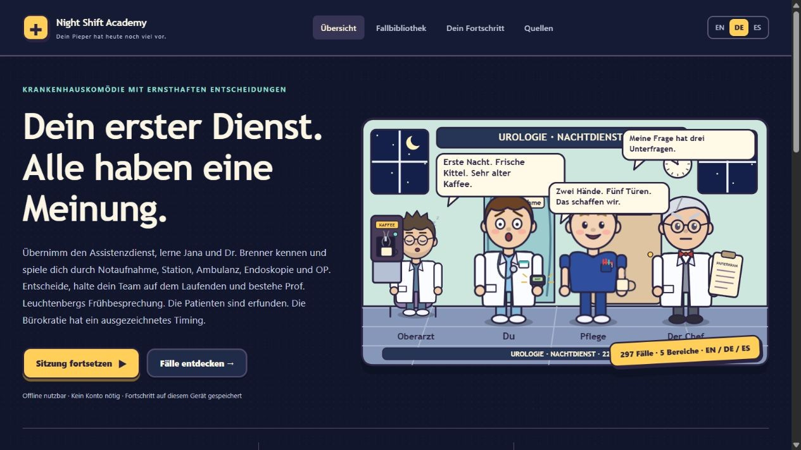

# Night Shift Academy

> **Residency-Game-DE – Rollenspiel als Assistenzärztin oder Assistenzarzt der Urologie.** Öffne `standalone.html` im Browser, wähle **DE** und tritt deinen ersten Nachtdienst an.

A cartoon hospital comedy and urology decision game in **English, German and Spanish**, now with **297 cases**: the 30 original three-decision stories plus all 267 questions from the supplied Urofragen main bank, each included once. Choose an avatar, meet the original cast, navigate illustrated departments, collect coffee quips and face the chief's morning-report quiz.

The expansion retains the original medical vignettes, questions, answer choices and explanations in all three languages. It covers **16 source specialties** across five game departments. The supplied classic HTML games remain unchanged in `classic/`.



## Start playing

1. Extract the ZIP to a folder.
2. Open **`standalone.html`** in a current browser. The complete game is embedded in one file and needs no installation or server.
3. Choose English, Deutsch or Español, select your avatar and start a department shift or mixed shift.
4. Browse the library by department, specialty or search. It shows **18 cases per page**.
5. Review each explanation and finish with the chief's quiz. Export your progress to keep a portable record.

`index.html` offers the same game with separate local assets. Keep the complete project for the original games, editable case data, import provenance and Python tools.

### English quick start

Open `standalone.html`, choose **English**, meet the cast and start a shift. Story cases contain three decisions; imported question-bank cases contain one original question with four or five choices. Filter by specialty to focus your practice. The nurse offers learning reminders, coffee adds workplace comedy, and the chief gives a separate final quiz. Export your progress as JSON for later analysis.

### Deutsch – Schnellstart

Öffnen Sie `standalone.html`, wählen Sie **Deutsch**, lernen Sie die Figuren kennen und starten Sie eine Schicht. Das Spiel enthält **297 Fälle**: 30 Geschichten mit je drei Entscheidungen und sämtliche 267 Originalfragen der gelieferten Hauptbank mit je einer Entscheidung und vier oder fünf Antworten. Wählen Sie ein Fachgebiet, nutzen Sie die Lernhinweise der Pflegekraft und stellen Sie sich dem Abschlussquiz des Chefs. Der Cartoonstil, die Dialoge und die Kaffeepausen bleiben erhalten. Exportieren Sie Ihren Fortschritt als JSON für eine spätere Auswertung.

**Neu in diesem Update:** Nach jeder Antwort siehst du, welche Option richtig war und warum. „Alle Antworten erklärt“ begründet jede Option. Janas Joker streicht eine falsche Antwort. Richtige Serien bringen Sprüche und Konfetti. Eine Karriereleiter führt von Famulant:in bis zur Legende des Nachtdienstes, und ein Sticker-Album macht Fortschritt sichtbar. *Revanche* wiederholt deine Fehler, *Fachgebiete* zeigen deine Schwachstellen mit Trainingsknopf, und die *Blitzrunde* bietet fünf schnelle Fragen. Tastatur: A–E oder 1–5 wählt, Enter geht weiter.

### Español – Inicio rápido

Abra `standalone.html`, elija **Español**, conozca al reparto e inicie una guardia. Hay **297 casos**: 30 historias con tres decisiones y las 267 preguntas originales del banco principal, cada una con una decisión y cuatro o cinco opciones. Filtre por especialidad, consulte los objetivos con la enfermera y complete el cuestionario final del jefe. Se conservan los dibujos, los diálogos y las pausas para el café. Exporte su progreso en JSON para analizarlo después.

## Case library

| Department | Story cases | Imported cases | Total |
| --- | ---: | ---: | ---: |
| Emergency | 6 | 26 | 32 |
| Ward | 6 | 23 | 29 |
| Clinic | 6 | 133 | 139 |
| Endoscopy | 6 | 22 | 28 |
| Theatre | 6 | 63 | 69 |
| **All departments** | **30** | **267** | **297** |

The library contains **357 decision steps and 1,382 answer options**. The story cases retain three choices per step. Of the 267 source questions, 223 have four choices and 44 have five; each has exactly one correct source answer. Separate CME modules, generated HTML copies and historical update blocks are not counted again.

The source specialties are andrology, functional urology, testicular cancer, infections, paediatric urology, muscle-invasive and non-muscle-invasive bladder cancer, renal cancer, operative urology, penile cancer, prostate cancer, reconstruction, trauma, urethral cancer, stones and upper-tract urothelial cancer. Department allocation follows the clinical task in each vignette; the source's oncology emphasis explains the larger clinic collection.

Imported cases show fictional patient names from `data/patient-names.json`. The case text alone determines sex, number of patients and age band. Two independent classifications of all 267 vignettes agreed on 265 cases; a judge resolved the other two. A review then corrected four more: a testicular-cancer case is male, and three intraoperative technique questions have a patient on the table. When the text does not state the sex (42 cases), the patient gets a gender-neutral first name. A vignette that compares several patients lists one surname per patient, for example *Weiß & Scholl*. The one question without any patient, a departmental meeting, shows a translated label and the head of department's portrait. Names are unique, age-appropriate and culturally consistent. They avoid the surnames of the story patients and the cast, famous people and medical puns. The 30 story patients now also record `sex`, taken from the pronouns in their texts or, where the text has none, from the original author's name choice; *Alex Morgan* stays unspecified. Portraits never give women or children stubble, and patients aged 75 or older get grey hair. No additional vital signs are invented. Missing or ambiguous ages remain unrecorded, and a case may have `patient.age: null` and `vitals: null`.

## Duties

A session no longer mixes every department. You choose a **duty**, and the session draws only that duty's cases, rotating through topics:

| Duty | Clock starts | Cases | Content |
| --- | ---: | ---: | --- |
| 🌙 Night shift (*Nachtdienst*) | 22:00 | 52 | Emergencies only: colic and obstructed or infected kidneys, retention, bleeding and clot retention, trauma, torsion, priapism, Fournier, acute infections, acute ward complications and emergency or consult surgery |
| 🎗️ Tumour board (*Tumorboard*) | Wed 15:30 | 90 | Oncological staging and treatment decisions, systemic and salvage therapy, metastatic disease, residual tumour |
| 🩺 Clinic (*Sprechstunde*) | 08:00 | 100 | Outpatient work-up, counselling and follow-up, including cancer follow-up, andrology, functional urology, stone metaphylaxis and elective paediatric urology |
| ✂️ Elective list (*OP-Programm*) | 07:30 | 55 | Planned operations and endoscopy: technique, anatomy, intraoperative findings and perioperative routine |

Each duty has its own briefing from the cast, whiteboard label and daylight or night window; the attending stays awake in the daytime. The tumour board meets in a conference room where the session's cases lie on the table as folders. The library filters by duty, every case card shows its duty, and the progress page reports performance by duty. Practice sessions started from the library, rematch or quick round take the duty of their cases, or a mixed rotation if the cases differ.

Every case's duty is stored as `duty` in `data/*.json`; imported questions take it from `data/import-selection.json`, so a re-import keeps it. The assignment classifies by the decision the question asks for, not only by the diagnosis: two independent classifications of all 297 cases agreed on 288, a judge resolved nine, and one review change moved autonomic dysreflexia during urodynamics from the night shift to the clinic. See [docs/VALIDATION.md](docs/VALIDATION.md).

## Schemas, anatomy atlas and own images

- **Teaching schemas:** 15 cartoon schematic drawings made for this game (`data/schemas.json`) with 189 tappable structures, from the urinary tract overview, kidney envelopes, prostate zones and bladder-wall T stages to urinary diversion, micturition control, the retroperitoneal lymph-node landing zones and VUR grades. 133 of the 297 cases link to one; questions about drugs, laboratory values, counselling or guidelines deliberately have none. After the last decision of a case, the explanation shows the matching schema with the case's key structures glowing (★). Every structure is tappable and shows its name and one key fact. The debrief and the logbook review show it too. The links between cases and schemas are in `data/case-schemas.json`.
- **Anatomy atlas:** a new *Atlas* page lists all schemas. *Find the structure* is a five-round tap quiz on a schema. A right tap gives confetti, a wrong one the splash, and 5 of 5 earns the *Anatomy ace* sticker. Quiz results never change case scores.
- **Own images:** put licensed PNG, JPEG or WebP files in `media/` and list them in `data/case-media.json`, with alt text and caption in EN/DE/ES, `credit` and `license`. The build embeds them and refuses a file without credit or licence, a file outside `media/` or an SVG. See [media/README.md](media/README.md). Do not add identifiable patient images.

The schemas are simplified teaching drawings, not to scale, and were not reviewed clinically. See [docs/VALIDATION.md](docs/VALIDATION.md) for how they were checked.

## Characters and game mechanics

- **Avatars and cartoon rooms:** choose your character and move through the hospital with the original cast and translated comedy.
- **Nurse's joker (Grace / Jana / Lucía):** once per question, the nurse crosses out one of the weakest wrong answers. It costs five simulated minutes and never changes points. Story cases also show their learning objectives. After answering, she only gives advice.
- **Answer marking and explanations:** after each decision the correct option is marked ✓ and a wrong choice ✗ (◐ for a partly appropriate story choice). A missed question shows **why the preferred answer is right**, and **"Every option explained"** opens the source rationale for each choice. The debrief and the logbook review repeat this.
- **Right or wrong you can feel:** a right answer brings confetti. A wrong one gets a cartoon *urine splash*, with droplets, a puddle and a line such as *Post-void dribble!*, plus a splash sound when pager sounds are on. New stickers pop up as a sticker instead of confetti, so confetti never follows a wrong answer.
- **Streaks:** consecutive correct decisions build a 🔥 streak. Streaks of 3, 5, 10, 15 … earn a special line from the cast and confetti. A wrong source answer gets exam-style teasing that points to the explanation; safety feedback stays serious.
- **Career ladder:** XP is the sum of your best score per case, so replaying a case improves XP, but repeating it does not inflate XP. Nine ranks lead from medical student to night-shift legend, each with its own joke and a promotion scene.
- **Sticker album:** 13 collectable stickers, e.g. for streaks, a perfect session, a perfect chief's quiz, a case in every department, a rematch at 100% or completing every case of a specialty. Locked stickers say how to earn them.
- **Targeted practice:** *Rematch* replays up to ten cases whose latest attempt was below 100%. The report can replay the current shift's misses. *Specialties* on the progress page lists mastery per source specialty, weakest first, with a *Train* button. The library can practise ten random cases from the current filter. The introduction offers a five-question *Quick round* that starts with unplayed cases.
- **Keyboard play:** A–F or 1–6 picks an answer, including in the chief's quiz; Enter continues.
- **Coffee:** during an unfinished session, a cup adds exactly **five simulated minutes** and a character quip. It changes no case score or vital signs. Outside an unfinished session, it only delivers a quip.
- **Pager sounds:** optional synthesised audio is off by default.
- **Chief's final quiz:** uses questions from completed case steps. Its results remain separate from saved case scores and CSV analysis.

Streaks, jokers, ranks and stickers are game motivation only. They are stored with local progress (`stats`, `badges`), derived from the logbook where possible, and never alter case scores, the exported `history` or the CSV analysis. Progress saved by the earlier release loads unchanged; existing achievements are credited quietly on first load. Confetti and animations respect the system setting for reduced motion.

Each source question gives 10 points for its original correct answer and 0 for another answer, with five fictional minutes per choice. The import does not invent clinical safety-error classifications. A source case has a maximum of 10 raw points; a three-step story has 30. Case results are displayed on a **0–100 scale**, so the two formats can be understood together. Source evidence flags and clinical review status are independent of game points.

The comedy and clock are fictional game mechanics. Points, coffee costs and simulated minutes are not clinical response times or a validated assessment of competence.

## Source import and review status

All 267 main-bank questions are included once, including **10 drafts** and **32 evidence-marked questions**. Draft and evidence notices remain visible. Of the imported questions, **51 carry an explicit source sign-off for German only**; the other **216 have no imported sign-off** (206 pending independent review and 10 drafts without a clinical review status). None has an imported English or Spanish sign-off. This expansion grants no new medical or translation approval.

Provenance is supplied in:

- `data/imported-source.json`: original DE/EN/ES content, option keys, explanations, citations, source version, language-specific sign-off information and content hashes.
- `data/import-selection.json`: the complete one-to-one source mapping and department allocation.
- `data/import-manifest.json`: archive name and SHA-256, selection hash, counts and import policy.
- [docs/QUELLENIMPORT.md](docs/QUELLENIMPORT.md): source inventory, duplicate-check method and allocation report.

The supplied archive's SHA-256 is `388ef0ed51fdd17971248bd3b7867fb35bf6d9622b2331464e6f9e1a9ece799b`. The importer checks unique IDs and normalized clinical text in each language; this catches exact repeated questions, not every possible semantic overlap between related topics.

To compare the delivered import with your original ZIP without writing files:

```text
python scripts/import_urofragen.py "Urofragen-GitHub-DE-EN-ES-2026-10-04.zip" --check
```

To reproduce the import, then rebuild the playable editions:

```text
python scripts/import_urofragen.py "Urofragen-GitHub-DE-EN-ES-2026-10-04.zip"
python scripts/manage.py build
```

Use the actual path to your original ZIP. The importer reads the domain metadata and main-bank JSON members only; it never executes scripts from the archive. It preserves the 30 existing story cases. Keep the supplied archive if you want to reproduce the source comparison later.

## Python automation

Use **Python 3.10 or newer**. The tools use the standard library, with no package installation required. Run commands from the project folder; on Windows, `py` can replace `python`.

| Task | Command | Result |
| --- | --- | --- |
| Validate | `python scripts/manage.py validate` | Checks languages, structure, answer markers, provenance metadata, references and local assets |
| Build | `python scripts/manage.py build` | Recreates `assets/catalog.js` and `standalone.html` |
| Serve locally | `python scripts/manage.py serve --port 8000` | Opens a local-only service at `http://127.0.0.1:8000/`; stop with Ctrl+C |
| Daily shift | `python scripts/manage.py schedule --date 2026-10-05 --seed team-a --duty night` | Creates 10 distinct cases of one duty (`night`, `board`, `clinic` or `elective`), rotating through topics, in `outputs/daily-shift.json`; without `--duty`, two per department as before |
| Analyse progress | `python scripts/manage.py analyse session-export.json --output outputs/progress.csv` | Writes one CSV row per decision, preserving repeated attempts |
| Package | `python scripts/manage.py package --output dist/night-shift-academy.zip` | Rebuilds and creates a ZIP with fixed timestamps and a SHA-256 file manifest |
| Python checks | `python -m unittest discover -s tests -v` | Runs the automation and import regression suite |
| Game checks | `node tests/tests-engine.cjs` | Runs engine, save, score and mixed-format case checks |
| Cartoon checks | `node tests/tests-cartoon.cjs` | Checks translated cast, artwork, accessible room controls and game extras |

Daily shifts are reproducible for the same library, date, seed and duty. Without `--duty` they favour varied difficulty within each department. Import the generated JSON using the game's daily-shift control; change the seed for another roster.

The progress export uses `version: 2` and a `history` array. Each completed attempt includes `caseId`, `area`, `score`, `maxScore`, `elapsed`, `criticalErrors`, `completedAt` and `answers`. The answer count follows the case: **one for an imported question, three for a story**. Each answer records `stepId`, `optionId`, `score` and `minutes`; the analyser validates these against the current library. CSV output has the same variable number of rows per attempt. `elapsed` sums case-decision minutes and excludes coffee and waiting on the overall game clock. Keep the matching library version if you alter a case after playing it.

Learner data stays in the local browser unless you export it. Back up progress before clearing storage or moving to another browser/device. Node.js is needed only for JavaScript development checks, not for playing or using the Python tools.

## Project structure and editing

```text
index.html                  Introduction and modern game interface
standalone.html             Generated complete single-file game
assets/styles.css           Base visual design
assets/cartoon.css          Cartoon scenes and game controls
assets/i18n.js              EN/DE/ES interface text
assets/banter.js             Translated dialogue and quips
assets/art.js                Original-style character and department artwork
assets/engine.js             Game and progress logic
assets/app.js                Interface, filters and pagination
assets/catalog.js            Generated case/reference library
data/emergency.json          32 emergency cases
data/ward.json               29 ward cases
data/clinic.json             139 clinic cases
data/endoscopy.json          28 endoscopy cases
data/theatre.json            69 theatre cases
data/imported-source.json    Original question snapshot and provenance
data/import-selection.json   Source-to-case mapping
data/import-manifest.json    Import counts and hashes
data/refs-*.json             Reference metadata and related-source links
scripts/import_urofragen.py  JSON-only source importer and comparison
scripts/manage.py            Build, validation, scheduling, analysis and packaging
tests/                      Regression checks
.github/workflows/check.yml GitHub checks and ZIP build
classic/                    Three unchanged supplied games
docs/                       Source and validation reports
outputs/daily-shift.json     Example daily shift
```

Cases have a unique `id`, an `area`, difficulty `level` (1–3), game `acuity`, teaching `patient`, translated `title`, `presenting`, `objectives` and `takeaway`, decision `steps` and reference IDs. Imported cases additionally have translated `topic` and `source` provenance, and their `patient` adds `sex` (`female`, `male` or `null`), `ageBand` and, for the case without a patient, a translated `label`. To rename an imported patient, edit `data/patient-names.json` (keyed by source question ID) and apply it with the importer, or edit both files consistently. The importer retains the source vignette and does not fill absent vital signs or ages with invented numbers.

Each step has a unique `id`, `kind`, translated `prompt`, options and a `best` option ID. Options have unique IDs, translated text/feedback, points, fictional minutes and a Boolean `critical` marker. One option scores 10 and matches `best`. Legacy stories may award partial points and mark safety errors; imported MCQs preserve their single correct key and use no invented safety-error penalties.

After editing, run `validate` and `build`, then include generated files with the source. The standalone builder embeds all local stylesheets, scripts and the favicon in their declared order. Keep styles in the order `styles.css`, `cartoon.css`; scripts in the order `i18n.js`, `banter.js`, `art.js`, `catalog.js`, `engine.js`, `app.js`. No JavaScript bundler is required.

## GitHub-ready ZIP

This delivery contains repository-ready files. **No remote repository or website is published.** The included GitHub workflow validates, tests, rebuilds and creates a ZIP artifact on pushes and pull requests; it does not deploy a website. It uses GitHub's official [checkout](https://github.com/actions/checkout), [Python setup](https://github.com/actions/setup-python) and [artifact upload](https://github.com/actions/upload-artifact) actions.

For optional later publication, the root `index.html` can serve as a GitHub Pages entry point. See the [official Pages setup guide](https://docs.github.com/en/pages/getting-started-with-github-pages/configuring-a-publishing-source-for-your-github-pages-site). The ZIP and single-file game work independently of GitHub.

## Clinical scope and rights

This is an educational game for rehearsal and discussion, not a clinical protocol or credential. Clinical judgment, supervision, local policies and current specialist guidance remain necessary for real patients. The complete game and its translations have not received a new independent specialist review as part of this expansion.

Original source citations and review metadata remain available. Related EAU guideline index links were checked as primary reference metadata; **the 267 imported questions were not newly checked against every guideline or certified clinically**. Such related links do not validate a specific dosing claim, translation, distractor or evidence level. See [docs/VALIDATION.md](docs/VALIDATION.md) for the distinction between software verification and medical review.

The original games in `classic/` retain their supplied medical claims, scoring, translations and notices unchanged. No ownership or licence has been inferred for either the games or the supplied question bank, and no invented licence is added. Check the applicable permissions before redistribution or public publication. Source links do not imply endorsement.
